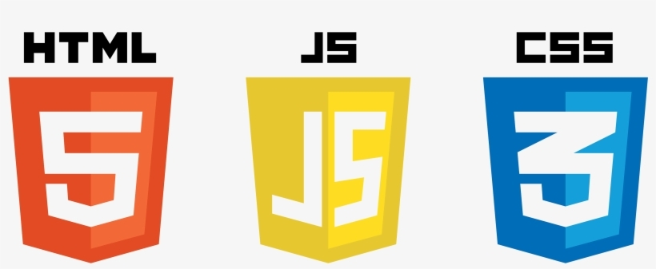
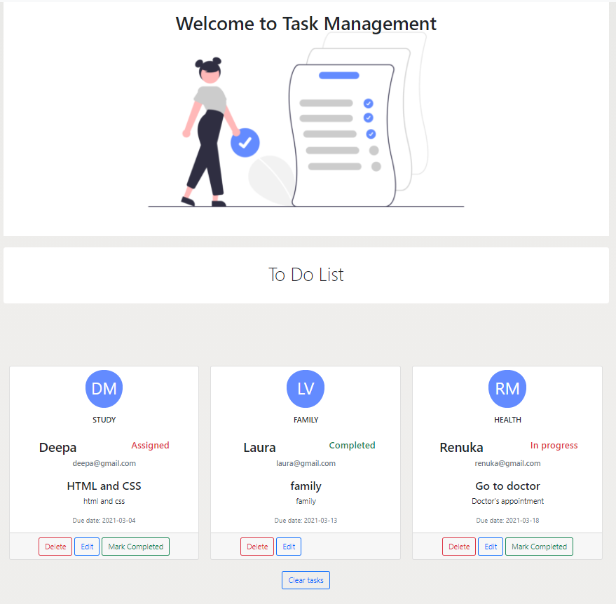

Team Project

1. Final project for Generation Program. 
2. This project was done by <a href='https://github.com/DeepaNethesh'>Deepa</a>, <a href ='https://github.com/mlvillarreal'>Laura</a> and <a href ='https://github.com/RenukaMano'>Renuka</a>.
<h4>Project to create a task planner web application<h4>
    <ul><li>Allows the user to create a list of tasks with task name, description, assignee, email, due date and status.</li> 
          <li>Validates user data before saving information.</li> 
          <li>Tasks are saved in local storage.</li> 
          <li>Tasks can be modified by the user(CRUD operations)</li> 
          <li>Task list can be deleted</li></ul>

<h4>Highlights:

     <ul><li>Programming languages: HTML, CSS & Javascripts </li> 
      <li>Bootstrap</li> 
      <li>Responsive Design</li> 
      <li>DOM Manipulation</li> 
      <li>Regular Expressions</li> 
      <li>Testing with Mocha/Chai</li>
<li></li></ul>

This is the link to the page : <a href ='https://deepanethesh.github.io/TaskManager/'>TaskManager App</a>

Steps:

1. Clone the repository
2. `npm install package.json`

